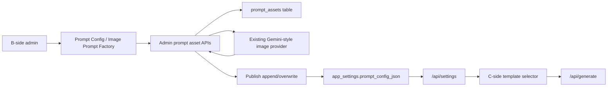

# Image Prompt Factory Design

## Status

Approved design draft for implementation planning.

This workspace is not a git repository, so this spec can be written but cannot be committed from the current directory.

## Context

The project is a lightweight B/C-side ecommerce image tool built with static HTML/CSS/JS plus `server.py`.

Current prompt distribution works like this:

- B-side admins edit prompt configuration through `admin.html` / `admin.js`.
- The server stores the normalized prompt configuration in SQLite `app_settings.prompt_config_json`.
- C-side clients fetch safe prompt configuration through `/api/settings`.
- C-side single-image generation uses `promptConfig.single.matrix`; `single.templates` is derived from that matrix.
- When a C-side user selects a template, `/api/generate` resolves the hidden template prompt server-side and wraps it with product-reference guardrails.

The new feature adds a B-side prompt factory that turns one or more ecommerce reference images into reusable prompts. These prompts should let C-side users upload their own product original image and generate ecommerce images similar to the reference style.

The feature is based on the local `amazon-image-prompts` skill workflow:

- Analyze reference image layout, copy hierarchy, scene, labels, typography, and risks.
- Preserve original product identity when a product image is provided.
- Generate Chinese and English reusable prompt-only prompts.
- Generate Image A with reference assistance.
- Generate Image B with prompt-only input.
- Compare Image A, Image B, and the reference style before publishing.

## Confirmed Product Decisions

- Place the feature inside the existing B-side `提示词配置` page as a new group named `图片提示词工厂`.
- Support both a prompt asset library and publishing to C-side templates.
- Reuse existing image model providers for generation and analysis. The first implementation should require an AOKAPI / Gemini-style `generateContent` provider because the workflow needs image understanding and image input support.
- Batch input supports one optional product original image plus one or more reference images. Each reference image produces one prompt asset.
- First complete workflow includes Image A, Image B, and a comparison result.
- Publish prompt assets into the existing platform/category/scenario matrix used by C-side single-image templates.
- Publishing supports both append and overwrite. Append is the default. Overwrite requires confirmation.

## Goals

- Let admins upload one or more reference ecommerce images and generate reusable prompt assets.
- Save generated prompt assets before publishing so admins can review, retry, edit, and reuse them.
- Preserve the existing C-side template selection and generation flow.
- Keep B-side analysis, validation images, and comparison notes private to admins.
- Make batch generation resilient: one failed reference image should not discard the rest of the batch.

## Non-Goals

- Do not add a separate C-side `同款参考图` page in the first version.
- Do not add a separate prompt-analysis provider type in the first version.
- Do not expose English prompts, validation images, raw analysis, or model debug data to C-side users.
- Do not implement multi-admin review roles or approval queues in the first version.
- Do not rely on the reference image at C-side generation time. Published prompts must work with only the user's uploaded product image and text prompt.

## Architecture

The feature has two persistence layers:

1. Prompt asset library: a new SQLite table stores factory outputs and workflow status.
2. Published C-side templates: publishing writes the final Chinese prompt into `prompt_config_json.single.matrix`.

This keeps drafts, validation images, failures, and review metadata out of the C-side prompt config while preserving the existing C-side `/api/settings` and `/api/generate` behavior.



## Data Model

Add a SQLite table named `prompt_assets`.

Recommended columns:

```text
id TEXT PRIMARY KEY
title TEXT NOT NULL DEFAULT ''
status TEXT NOT NULL DEFAULT 'draft'
reference_images_json TEXT NOT NULL DEFAULT '[]'
product_image_json TEXT NOT NULL DEFAULT '{}'
reference_analysis TEXT NOT NULL DEFAULT ''
chinese_prompt TEXT NOT NULL DEFAULT ''
english_prompt TEXT NOT NULL DEFAULT ''
image_a_url TEXT NOT NULL DEFAULT ''
image_b_url TEXT NOT NULL DEFAULT ''
comparison TEXT NOT NULL DEFAULT ''
target_platform_id TEXT NOT NULL DEFAULT ''
target_category_id TEXT NOT NULL DEFAULT ''
target_scenario_id TEXT NOT NULL DEFAULT ''
publish_mode TEXT NOT NULL DEFAULT 'append'
published_template_id TEXT NOT NULL DEFAULT ''
error TEXT NOT NULL DEFAULT ''
request_json TEXT NOT NULL DEFAULT '{}'
response_json TEXT NOT NULL DEFAULT '{}'
created_at TEXT NOT NULL
updated_at TEXT NOT NULL
published_at TEXT
```

Status values:

- `draft`: created or manually saved, not fully generated.
- `generating`: active generation is in progress.
- `generated`: prompts and validation outputs are ready for review.
- `published`: successfully published into the C-side prompt matrix.
- `failed`: latest generation or retry failed.

The JSON image fields should use the same shape as existing reference images where possible:

```json
{
  "name": "reference-01.png",
  "size": "1024x1024",
  "url": "data:image/png;base64,..."
}
```

The first version stores uploaded factory images as data URLs in SQLite, matching the existing reference image payload style. Server-side file storage is deferred until image payload size becomes a measured problem.

## Backend APIs

All endpoints are admin-only under `/api/admin`.

### List Prompt Assets

`GET /api/admin/prompt-assets?status=&limit=&offset=`

Returns asset summaries for the B-side material list.

### Create Prompt Assets

`POST /api/admin/prompt-assets`

Request body:

```json
{
  "productImage": { "name": "product.png", "size": "1024x1024", "url": "data:image/png;base64,..." },
  "referenceImages": [
    { "name": "ref-01.png", "size": "1024x1024", "url": "data:image/png;base64,..." }
  ],
  "providerModelId": "optional-model-id"
}
```

Creates one asset per reference image. If `productImage` is omitted, the asset can still generate reusable prompts but validation should be marked as weaker.

### Generate Or Retry A Prompt Asset

`POST /api/admin/prompt-assets/{id}/generate`

Runs the full workflow for one asset synchronously. Batch generation in the first version is controlled by the frontend, which calls this single-asset endpoint sequentially so each reference image saves or fails independently.

### Update Prompt Asset

`PATCH /api/admin/prompt-assets/{id}`

Allows admins to edit title, Chinese prompt, English prompt, comparison notes, or selected publish target before publishing.

### Publish Prompt Asset

`POST /api/admin/prompt-assets/{id}/publish`

Request body:

```json
{
  "platformId": "amazon-aplus",
  "categoryId": "3c-digital-accessories",
  "mode": "append",
  "scenarioId": "optional-existing-scenario-id",
  "title": "Reference Style Feature Infographic"
}
```

Append mode:

- Validate platform and category exist.
- Generate a unique scenario id and template id.
- Add a new scenario to the selected category.
- Use the asset's Chinese prompt as the C-side template prompt.

Overwrite mode:

- Validate platform, category, and scenario exist.
- Require a frontend confirmation before calling the endpoint.
- Replace the target scenario title and prompt.
- Keep platform/category structure stable.

After publishing, normalize and persist `prompt_config_json`. This will regenerate `single.templates` from `single.matrix`.

## Model Workflow

Each asset runs through four stages.

### 1. Reference Analysis

Use a Gemini-style existing image provider to analyze the reference image and optional product image. Ask the model for structured JSON with:

- Canvas ratio and crop.
- Product scale, camera angle, and placement.
- Background, lighting, shadows, props, badges, labels, icons, and callouts.
- Typography hierarchy and text locations.
- Visible Chinese text rewritten as concise Amazon-appropriate English.
- Image type, such as main product pack, feature infographic, dimension image, usage scene, comparison, package/accessories, A+ brand panel, exploded structure, or technology visual.
- Risk points such as fake badges, unsupported claims, unreadable long text, or physically impossible product placement.

The server should attempt to parse JSON from the model output. If parsing fails, save the raw excerpt in `error` and mark the asset failed.

### 2. Prompt Drafting

Generate Chinese and English prompt-only prompts from the analysis.

Rules:

- The prompt must work with only one uploaded original product image and text prompt.
- Do not rely on a separate reference image being present.
- Do not write `参考图一` or equivalent reference-only language.
- Preserve exact product identity: shape, color, proportions, material, screen, buttons, ports, openings, logo, accessories, and visible construction.
- Translate visible Chinese copy into short English copy in generated images unless explicitly changed later.
- Avoid fake certifications, platform logos, bestseller labels, discounts, exact unsupported percentages, and medical/technical claims not provided by the user.
- Use placeholders for replaceable feature text when useful, such as `{PRODUCT_NAME}`, `{KEY_FEATURE_1}`, `{KEY_FEATURE_2}`, `{DIMENSIONS}`, `{WEIGHT}`, `{SCENE}`, or `{MODULE_1}`.

The Chinese prompt is the publishable default for C-side templates. The English prompt remains B-side supporting material.

### 3. Validation Images

Generate two validation images when a product image is present.

- Image A: product image plus reference image plus a reference-assisted prompt. This checks whether the model can match the reference with direct reference help.
- Image B: product image plus Chinese prompt only. This checks whether the published prompt can work in the actual C-side flow.

If no product image is provided, still generate the prompts, but mark the asset as `未验证产品迁移` in the comparison or status notes. The first version may skip Image A and Image B in that case.

### 4. Comparison

Call the Gemini-style model again to compare the reference image, Image A, and Image B. Store a concise B-side-only comparison:

- What matched.
- What drifted.
- Product fidelity risks.
- Text or claim risks.
- Suggested prompt changes.

The first version does not need automatic prompt refinement loops. Admins can edit the prompt and retry manually.

## B-Side UI

Add a new group to `PROMPT_GROUPS` in `admin.js`:

```js
{ id: "factory", label: "图片提示词工厂" }
```

Inside the `提示词配置` page, the group layout has two main zones.

Left zone: create/generate task.

- Optional product original image upload.
- Batch reference image upload.
- Gemini-style model selection or default compatible model notice.
- Primary button: `生成提示词与验证图`.

Right zone: asset library and review.

- Status counters: all, draft, generated, failed, published.
- Asset list with per-reference status.
- Detail panel with reference analysis, Chinese prompt, English prompt, Image A, Image B, and comparison.
- Actions: save draft, retry current asset, publish to C-side.
- Publish form: platform, category, mode, scenario title or scenario selector.

The B-side page should keep the existing dense admin-console style. This is an operational tool, not a landing page.

## C-Side Behavior

C-side behavior stays mostly unchanged.

- Published prompt assets appear as normal scenarios under their selected platform/category.
- C-side users only see template titles and selection metadata allowed by current `client_prompt_config` behavior.
- Prompt text remains hidden from `/api/settings` and is resolved server-side during `/api/generate`.
- C-side generation uses the same strict product-reference wrapper already used by template generation.

## Error Handling

- No compatible model: show a B-side notice asking the admin to configure an AOKAPI / Gemini image provider.
- Single asset failure: save the error and any completed partial outputs. Allow retry for that asset.
- Batch failure: completed assets remain saved; failed assets retain failure status.
- Model returns malformed JSON: attempt JSON extraction, then fail the stage with a readable error if parsing still fails.
- Image generation returns no image: mark only that stage failed and keep analysis/prompts.
- Publish target invalid: reject the request without mutating prompt config.
- Overwrite mode: require frontend confirmation before publish.
- C-side config privacy: never include asset analysis, validation images, raw request/response JSON, or English prompt in `/api/settings`.

## Testing Plan

Backend tests:

- `init_db` creates `prompt_assets`.
- Prompt asset creation creates one row per reference image.
- Asset update persists editable fields without corrupting JSON image fields.
- Publishing in append mode creates a new scenario under the selected platform/category.
- Publishing in overwrite mode replaces the selected scenario title and prompt.
- Invalid platform/category/scenario publish targets are rejected.
- `client_prompt_config` still strips prompt text and does not expose prompt asset private fields.
- Existing prompt-config normalization tests continue passing.

Frontend structure tests:

- `admin.html` and `admin.js` expose the `图片提示词工厂` group under prompt configuration.
- Factory UI contains optional product upload, reference upload, generate button, asset list, detail panel, retry action, and publish action.
- Publish mode toggles between append title input and overwrite scenario selector.
- Overwrite mode includes a confirmation path.

Manual QA:

- Configure a Gemini-style provider.
- Upload one product image and two reference images.
- Generate assets and verify each reference creates a separate library item.
- Verify Image A uses product plus reference, and Image B uses product plus prompt only.
- Publish one asset as append and confirm it appears in C-side platform/category/scenario selection.
- Publish one asset as overwrite and confirm the selected C-side scenario updates.
- Test failure behavior by removing the compatible provider token.

## Implementation Notes

- Prefer reusing existing helper functions for auth, admin routing, model provider lookup, reference image normalization, upstream calls, image extraction, and prompt-config normalization.
- Keep the first version synchronous and sequential from the frontend. A background job table can be added later if calls exceed acceptable request times.
- Keep published prompts concise enough for current `PROMPT_TEXT_LIMIT`.
- Use existing toast and panel styling patterns in `admin.js` / `styles.css`.
- Do not change the C-side generation request shape unless a published prompt requires no existing path, which should not happen in this design.

## Implementation Decisions

- Store uploaded prompt factory images as data URLs in SQLite for the first version.
- Run batch generation by sequentially calling the single-asset generate endpoint from the frontend.
- Do not automatically regenerate Image A or Image B after an admin edits a prompt. Admins must click retry/regenerate for the selected asset, which keeps expensive model calls explicit.
